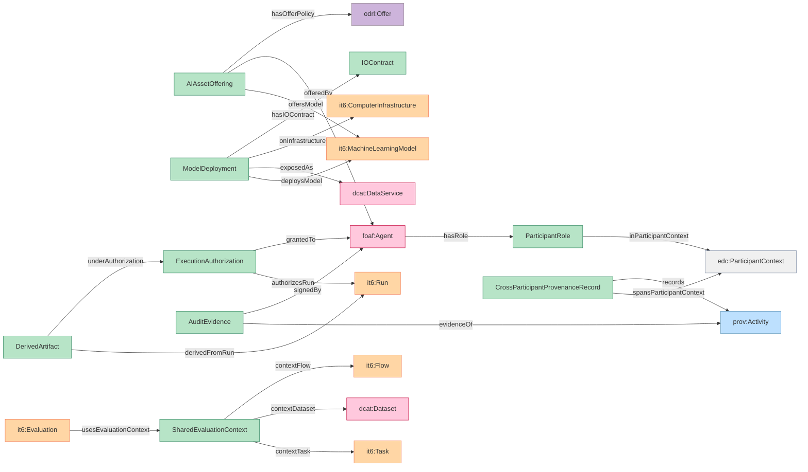

# DAIMO class diagram (Mermaid)

Preview in VS Code: install the extension **"Markdown Preview Mermaid Support"** (bierner.markdown-mermaid), then open this file in preview (Ctrl+Shift+V).

Also renders natively on GitHub.

---

## Diagram A — Subclass hierarchy

Green = DAIMO native. Grey = reused from external vocabularies.

```mermaid
classDiagram
    direction TB

    class odrl_Offer["odrl:Offer"]
    class odrl_Agreement["odrl:Agreement"]
    class prov_Entity["prov:Entity"]
    class prov_Bundle["prov:Bundle"]
    class prov_Role["prov:Role"]
    class dcat_Resource["dcat:Resource"]
    class dcat_Dataset["dcat:Dataset"]
    class it6_MachineLearningModel["it6:MachineLearningModel"]

    class AIAssetOffering
    class ExecutionAuthorization
    class ModelDeployment
    class DerivedArtifact
    class CrossParticipantProvenanceRecord
    class AuditEvidence
    class ParticipantRole
    class ModelProvider
    class ModelConsumer
    class PlatformOperator
    class Evaluator
    class GovernanceActor
    class IOContract
    class SharedEvaluationContext

    AIAssetOffering --|> odrl_Offer
    ExecutionAuthorization --|> odrl_Agreement
    ModelDeployment --|> prov_Entity
    DerivedArtifact --|> prov_Entity
    DerivedArtifact --|> dcat_Resource
    CrossParticipantProvenanceRecord --|> prov_Bundle
    AuditEvidence --|> prov_Entity
    ParticipantRole --|> prov_Role
    ModelProvider --|> ParticipantRole
    ModelConsumer --|> ParticipantRole
    PlatformOperator --|> ParticipantRole
    Evaluator --|> ParticipantRole
    GovernanceActor --|> ParticipantRole
    it6_MachineLearningModel --|> dcat_Dataset

    style AIAssetOffering fill:#b7e4c7
    style ExecutionAuthorization fill:#b7e4c7
    style ModelDeployment fill:#b7e4c7
    style DerivedArtifact fill:#b7e4c7
    style CrossParticipantProvenanceRecord fill:#b7e4c7
    style AuditEvidence fill:#b7e4c7
    style ParticipantRole fill:#b7e4c7
    style ModelProvider fill:#b7e4c7
    style ModelConsumer fill:#b7e4c7
    style PlatformOperator fill:#b7e4c7
    style Evaluator fill:#b7e4c7
    style GovernanceActor fill:#b7e4c7
    style IOContract fill:#b7e4c7
    style SharedEvaluationContext fill:#b7e4c7
    style odrl_Offer fill:#eeeeee
    style odrl_Agreement fill:#eeeeee
    style prov_Entity fill:#eeeeee
    style prov_Bundle fill:#eeeeee
    style prov_Role fill:#eeeeee
    style dcat_Resource fill:#eeeeee
    style dcat_Dataset fill:#eeeeee
    style it6_MachineLearningModel fill:#eeeeee
```

## Diagram B — Property network (who links to whom)

Shows the main object properties between DAIMO classes and the reused vocabulary.

## Diagram C — Instance graph of the flood-risk scenario

Concrete instances from [examples/flood-risk-scenario.ttl](../examples/flood-risk-scenario.ttl).

```mermaid
graph TB
    classDef daimo fill:#b7e4c7,stroke:#40916c
    classDef model fill:#ffd6a5,stroke:#f4845f
    classDef agent fill:#cdb4db,stroke:#9a8c98
    classDef run fill:#bde0fe,stroke:#6096ba

    upm([UPM - ModelProvider]):::agent
    mun([Leganés - ModelConsumer]):::agent
    ines([INESData Op - PlatformOperator]):::agent

    m2[flood-risk-v2<br/>it6:MachineLearningModel]:::model
    m1[flood-risk-v1<br/>baseline]:::model

    off2[offering-flood-v2<br/>AIAssetOffering]:::daimo
    off1[offering-flood-v1<br/>AIAssetOffering]:::daimo

    pol[flood-risk-policy<br/>odrl:Offer CC-BY]

    dep[deployment-flood-v2<br/>ModelDeployment]:::daimo
    svc[flood-risk-service<br/>dcat:DataService]
    ioc[IOContract<br/>JSON/GeoJSON OAuth2]:::daimo
    infra[UPM GPU cluster<br/>it6:ComputerInfrastructure]

    auth[agreement-municipality<br/>ExecutionAuthorization]:::daimo
    run[run-2026-04-20<br/>it6:Run]:::run
    pred[prediction-legs<br/>DerivedArtifact]:::daimo
    aud[audit-run-legs<br/>AuditEvidence]:::daimo

    evalctx[SharedEvaluationContext<br/>ClimateBench-v1, seed=42]:::daimo
    ev2[eval-flood-v2 Accuracy=0.89]
    ev1[eval-flood-v1 Accuracy=0.82]

    upm -.->|offeredBy| off2
    off2 -->|offersModel| m2
    off2 -->|hasOfferPolicy| pol
    off1 -->|offersModel| m1

    dep -->|deploysModel| m2
    dep -->|exposedAs| svc
    dep -->|hasIOContract| ioc
    dep -->|onInfrastructure| infra

    mun -.->|grantedTo| auth
    auth -->|authorizesRun| run
    run -.->|wasAssociatedWith| mun
    pred -->|derivedFromRun| run
    pred -->|underAuthorization| auth
    aud -->|evidenceOf| run

    ev2 -->|evaluates| m2
    ev1 -->|evaluates| m1
    ev2 -->|usesEvaluationContext| evalctx
    ev1 -->|usesEvaluationContext| evalctx
```

## Statistics to sanity-check

- DAIMO-native classes: **14** (9 + 5 ParticipantRole subclasses)
- External classes referenced: **14**
- Alignment axioms (rdfs:subClassOf into reused vocab): **8**
- Property-level alignment (rdfs:subPropertyOf): **11**
- SHACL shapes: **10**
- CQs: **23**
- Example KG triples: **192**

If any of those feel wrong, the diagrams are the fastest place to catch it.
